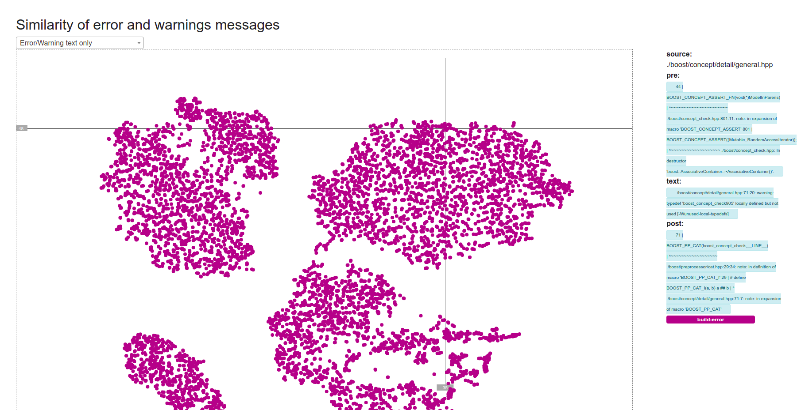

# Spack Monitor NLP



This is an effort to see if we can do some kind of clustering using the warning and error messages in
the server. The goal will be to:

1. retrieve current warnings and errors via the spack monitor API
2. build a word2vec model using them.
3. output embeddings for each
4. cluster!

⭐️ [View Interface](https://buildsi.github.io/spack-monitor-nlp/) ⭐️

You'll see that the best clustering comes from just using the error or warning messages,
and that most of the clusters are boost errors. Could it be that a direct match (e.g.,
parsing libraries in advance to identify text of errors and using that) is better?
Perhaps! And in fact we could do some kind of KNN based on that too. This is more
of an unsupervised clustering (we don't have labels). 

## Usage

```bash
$ python -m venv env
$ source env/bin/activate
$ pip install -r requirements.txt
```

Then download data from spack monitor

```bash
$ python 1.get_data.py
```

This will generate a file of errors and warnings!

```bash
$ tree data/
data/
├── errors.json
└── warnings.json
```

We next want to preprocess the data and generate models / vectors!

```bash
$ python 2.vectors.py
```

We are currently only parsing errors, as it's a smaller set and we are more interested
in build errors than warnings that clutter the signal. For the "error only" (or parsed) approach
we look for strings that have `error:` and split and take the right side of that. For all other
processing methods, we remove paths (e.g., tokenize then remove anything with an os.sep or path separator).

Some data will be generated in data, and assets for the web interface will go
into [docs](docs). The interface allows you to select and see the difference between
the models, and clearly just using the error messages (parsed or not) has the strongest signal (best clustering).

## TODO

 - try UMAP
 - add heatmap / density map to visualization
 - try to make barplot of errors
 - can we parse error messages out of binaries?
 
## License

Spack is distributed under the terms of both the MIT license and the
Apache License (Version 2.0). Users may choose either license, at their
option.

All new contributions must be made under both the MIT and Apache-2.0
licenses.

See [LICENSE-MIT](https://github.com/spack/spack/blob/develop/LICENSE-MIT),
[LICENSE-APACHE](https://github.com/spack/spack/blob/develop/LICENSE-APACHE),
[COPYRIGHT](https://github.com/spack/spack/blob/develop/COPYRIGHT), and
[NOTICE](https://github.com/spack/spack/blob/develop/NOTICE) for details.

SPDX-License-Identifier: (Apache-2.0 OR MIT)

LLNL-CODE-811652
